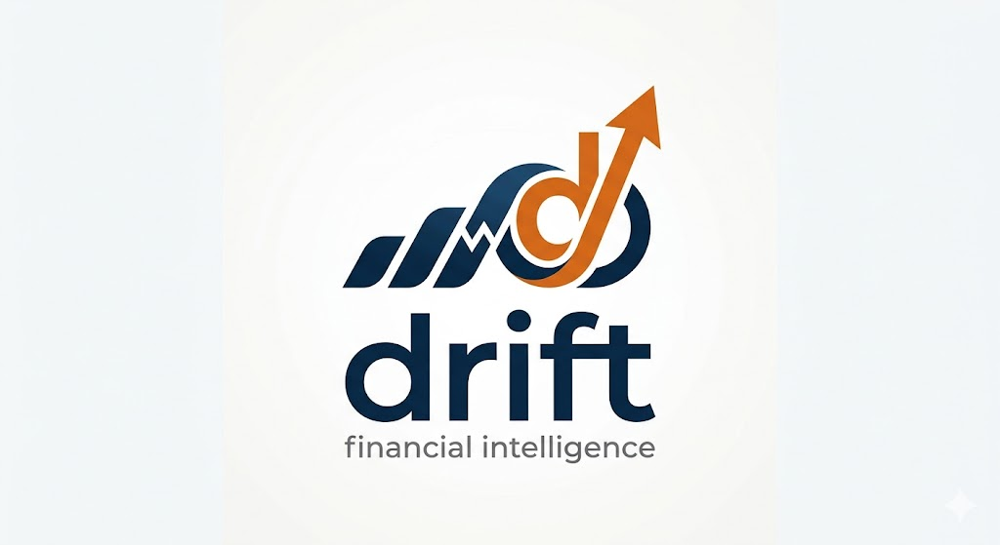

<p align="center">
  
</p>

<h1 align="center">Drift.ai</h1>

<p align="center">
  Private AI lifestyle drift audits for people who want to know where the extra money went.
</p>

<p align="center">
  <a href="https://youtu.be/IvfGUKCkWuE?si=iAnS7_1s4fM2Eadb">Link to the demo</a>
</p>

Drift.ai is a private AI lifestyle drift audit. It replaces the manual workflow of downloading bank transactions, building a spreadsheet, comparing old spending to recent spending, guessing what changed, and writing a plan by hand.

The target user is an early-career professional who recently got a raise, new job, moved cities, or changed routines and now wonders why the extra money feels invisible.

## One Workflow Replaced

**Before Drift**

1. Download bank statements or CSVs.
2. Clean categories manually.
3. Build monthly category totals in a spreadsheet.
4. Compare old months against recent months.
5. Guess which increases are meaningful.
6. Write notes about why the change happened.
7. Decide what to do next.
8. Revisit the same work again after future purchases.

**After Drift**

1. Import a CSV.
2. Drift detects inflation-adjusted old-normal vs recent-normal category changes.
3. Pattern Lab uses local AI to interview the user about why the pattern started.
4. Drift saves behavior tags and follow-up context.
5. Intercept simulates a future repeat purchase and records intent.
6. The report cites the scan facts, explains behavior, gives a 30-day recovery path, and exports or emails a PDF.

## Why It Matters

Budgeting apps show what someone spent. Drift shows what their spending became.

The value is time saved, clearer behavior insight, and a paid private report that turns financial drift into a specific recovery path for a specific life-change moment.

## Try It Out

- Live app: https://drift-ai-lime.vercel.app
- Local AI demo: run locally with Ollama using the setup below
- Demo CSVs: `apps/web/tests/fixtures/`
- Income and spending demo CSV: `apps/web/tests/fixtures/income-spend-drift.csv`

For the strongest demo, run the app locally with Ollama. The deployed app proves hosting, auth, payment, and report flow; the local run proves private AI generation with Qwen.

## Payment Proof

Drift includes a $1 report unlock through Stripe Checkout. The paid deliverable is the private PDF report with the diagnosis, behavior explanation, 30-day recovery path, intercept result, privacy note, and cited scan facts.

## Validation

The MVP includes signup, report email capture, and a $1 checkout path so interest can be measured through account creation, report requests, and payment intent. Demo feedback should track whether users recognize the workflow, whether the report feels worth paying for, and whether they would try it with their own exported CSV.

## AI-Native Loop

Drift uses deterministic math for trust and local AI for the behavior workflow.

1. **Math finds the pattern.** The scan compares old-normal months with recent-normal months after adjusting the old normal with the latest BLS CPI-U inflation rate when available. It falls back to 3% if the live rate cannot load.
2. **AI interviews the user.** Pattern Lab asks why a flagged pattern started, then asks a follow-up question based on the answer and behavior tag.
3. **AI classifies behavior.** Tags include reward spending, stress convenience, social pressure, habit creep, life event, and intentional upgrade.
4. **AI writes recovery language.** Local Qwen through Ollama turns category, overspend, tag, answer, and follow-up context into a short recovery path.
5. **AI writes the report.** The report review cites only scan facts, saved behavior notes, and intercept decisions.

Raw transaction rows stay local. The local demo uses Ollama/Qwen.

## Cash Flow View

Drift also maps cash flow from the imported CSV. Positive rows are treated as income, negative rows are treated as spending, and income is excluded from Drift Score math.

The Scan page shows:

- income vs spending bars by month
- category spending mix
- income change
- spending change
- the monthly overspend used to start the projection

Use `apps/web/tests/fixtures/income-spend-drift.csv` to test this flow. Expected output:

- Drift Score: `61`
- Monthly overspend: `$94`
- Top drift: `Dining`
- New pattern to review: `Rides`
- Income rises from `$4,200` to `$5,200`
- Spending rises from `$1,860` to `$2,020`

## Data Sources And Citations

The demo uses user-provided CSV evidence or Plaid Sandbox transactions. Reports cite the evidence used in the scan:

- Drift Score
- Monthly overspend
- Category old normal
- Category recent normal
- Category monthly overspend
- Behavior tags
- Intercept decisions
- BLS CPI-U inflation rate used to adjust old-normal spending

The what-if scenario is a user-adjustable calculation for planning.

Inflation adjustment uses the public BLS CPI-U series `CUUR0000SA0`. If the live request fails, Drift falls back to a 3% assumption and labels that fallback in the app.

## Stack

- Web: Next.js, React, shadcn-style components, Tailwind
- Backend: FastAPI for standalone backend routes, plus Next API routes for deployed web routes
- Database: Supabase for summary-only account backup and email/report interest
- Auth: Auth0
- Finance API: Plaid Sandbox
- Payments: Stripe Checkout / Payment Link
- Email: Resend
- Local AI: Ollama with `qwen2.5:0.5b`
- Tests: Vitest, Pytest, Playwright
- Hosting: Vercel for the web app; FastAPI can be deployed separately if needed

## Required Environment

Create or update both local env files:

```txt
.env.local
apps/web/.env.local
```

Minimum local web variables:

```txt
APP_BASE_URL=http://localhost:3000
AUTH0_BASE_URL=http://localhost:3000
AUTH0_DOMAIN=
AUTH0_CLIENT_ID=
AUTH0_CLIENT_SECRET=
AUTH0_SECRET=

NEXT_PUBLIC_SUPABASE_URL=
NEXT_PUBLIC_SUPABASE_PUBLISHABLE_KEY=
NEXT_SUPABASE_SERVICE_ROLE_KEY=

DRIFT_PLAID_CLIENT_ID=
DRIFT_PLAID_SECRET=
DRIFT_PLAID_ENVIRONMENT=sandbox
DRIFT_PLAID_PRODUCTS=transactions
DRIFT_PLAID_COUNTRY_CODES=US

STRIPE_SECRET_KEY=
NEXT_PUBLIC_STRIPE_PAYMENT_LINK_URL=
DRIFT_SCAN_PRICE_CENTS=100

RESEND_API_KEY=
DRIFT_REPORT_EMAIL_FROM=Drift <onboarding@resend.dev>

OLLAMA_GENERATE_URL=http://localhost:11434/api/generate
OLLAMA_MODEL=qwen2.5:0.5b
NEXT_PUBLIC_PREMIUM_GATE_ENABLED=false
```

For Vercel, add the same production values with `vercel env add`.

## Supabase Setup

Run the SQL schema in:

```txt
supabase/schema.sql
```

Supabase stores:

- account profiles
- scan summaries
- behavior insights
- intercept decisions
- what-if settings
- report email leads

Supabase stores summaries and saved choices. Raw merchant/date/sourceHash transaction rows stay in the browser.

## Run Locally

Install dependencies:

```powershell
npm install
python -m pip install -r requirements.txt
```

Start Ollama:

```powershell
ollama serve
```

Pull the local model:

```powershell
ollama pull qwen2.5:0.5b
```

Start the web app:

```powershell
npm run dev:web
```

Open:

```txt
http://localhost:3000
```

Optional FastAPI backend:

```powershell
npm run dev:api
```

FastAPI runs at:

```txt
http://localhost:8000
```

## Docker Local Run

Browsers cannot start Docker or Ollama when a user logs in. Start the local demo stack before presenting:

```powershell
Copy-Item .env.docker.example .env
notepad .env
docker compose up --build
```

This starts:

- Next.js web
- FastAPI backend
- Ollama
- Qwen model pull helper

Open:

```txt
http://localhost:3000
```

## Test Commands

Run the full automated pass:

```powershell
npm test
npm run test:api
npm run typecheck
npm run lint --workspace @drift/web
npm run build:web
npm run test:e2e --workspace @drift/web
```

Expected: all pass.
